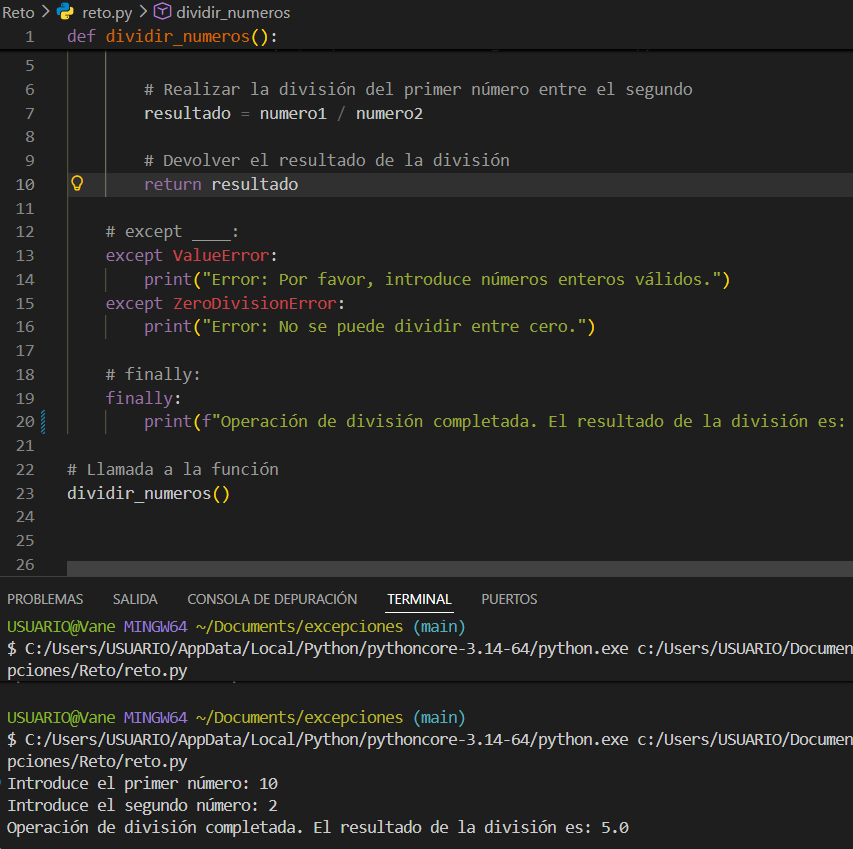
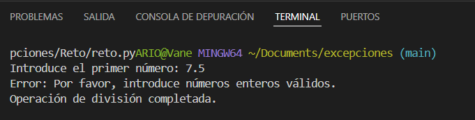
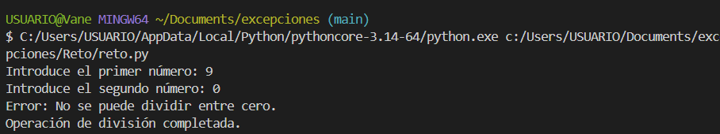

# 🐍 Manejo de Excepciones en Python
### GA1-220501096-01-AA1-EV05 – Python Intermedio

## 📁 Estructura del Proyecto

```
excepciones/
│── Ejemplos/
│   ├── ejemplo.py
│── Reto/
│   └── reto.py
└── README.md

## 📘 ¿Qué son las Excepciones?

Las **excepciones** son eventos que ocurren durante la ejecución de un programa y que interrumpen el flujo normal de las instrucciones. En Python, cuando el intérprete encuentra una situación que no puede manejar (como dividir entre cero, un archivo inexistente o un tipo de dato inválido), **lanza una excepción**.

Si las excepciones no son capturadas y manejadas correctamente, el programa termina abruptamente mostrando un mensaje de error. El manejo adecuado de excepciones permite que el programa responda de manera controlada y elegante ante situaciones inesperadas.

**Ejemplo de excepción sin manejo:**
```python
resultado = 10 / 0
# ZeroDivisionError: division by zero ← El programa se detiene aquí
```

**Ejemplo con manejo de excepción:**
```python
try:
    resultado = 10 / 0
except ZeroDivisionError:
    print("No es posible dividir entre cero.")
# El programa continúa ejecutándose normalmente
```

---

## 🔍 Diferencia entre `except`, `else` y `finally`

| Bloque | ¿Cuándo se ejecuta? | Uso principal |
|--------|---------------------|---------------|
| `try` | Siempre (contiene el código que puede fallar) | Encapsular código riesgoso |
| `except` | **Solo si ocurre una excepción** dentro del bloque `try` | Capturar y manejar el error |
| `else` | **Solo si NO ocurre ninguna excepción** en el `try` | Ejecutar lógica cuando todo salió bien |
| `finally` | **Siempre**, ocurra o no una excepción | Liberar recursos, cerrar archivos, mensajes finales |

### Ejemplo ilustrativo:

```python
try:
    numero = int(input("Ingresa un número: "))
    resultado = 100 / numero

except ValueError:
    print("⚠️  Error: Debes ingresar un número válido.")

except ZeroDivisionError:
    print("⚠️  Error: No puedes dividir entre cero.")

else:
    # Se ejecuta solo si no hubo excepciones
    print(f"✅ Resultado: {resultado}")

finally:
    # Se ejecuta SIEMPRE, sin importar qué ocurrió
    print("🔚 Operación finalizada.")
```

**Flujo de ejecución:**

```
Entrada válida (ej: 5)   → try ✓ → else ✓ → finally ✓
Entrada inválida (texto) → try ✗ → except ValueError ✓ → finally ✓
Entrada cero (0)         → try ✗ → except ZeroDivisionError ✓ → finally ✓
```

---

## 🏆 Reto – Función `dividir_numeros()`

### Código solución

```python
def dividir_numeros():
    try:
        numero1 = int(input("Introduce el primer número: "))
        numero2 = int(input("Introduce el segundo número: "))

        # Realizar la división del primer número entre el segundo
        resultado = numero1 / numero2

        # Devolver el resultado de la división
        return resultado

    except ValueError:
        print("Error: Por favor, introduce números enteros válidos.")

    except ZeroDivisionError:
        print("Error: No se puede dividir entre cero.")

    finally:
        print("Operación de división completada.")


# Llamada a la función
dividir_numeros()
```

### Capturas de ejecución

#### ✅ Caso 1 – División exitosa
Evidencia: 
```
Introduce el primer número: 10
Introduce el segundo número: 2
Operación de división completada.
>>> Resultado devuelto: 5.0
```

#### ⚠️ Caso 2 – Error por valor no numérico (`ValueError`)
Evidencia: 
```
Introduce el primer número: 7.5
Error: Por favor, introduce números enteros válidos.
Operación de división completada.
```

#### ⚠️ Caso 3 – Error por división entre cero (`ZeroDivisionError`)
Evidencia: 
```
Introduce el primer número: 9
Introduce el segundo número: 0
Error: No se puede dividir entre cero.
Operación de división completada.
```

> **Nota:** En todos los casos el bloque `finally` se ejecuta, mostrando siempre el mensaje `"Operación de división completada."`, lo que garantiza que el usuario siempre recibe retroalimentación sobre el estado final de la operación.

---

## 💡 Reflexión Personal

El manejo de excepciones es una de las habilidades más importantes que puede desarrollar un programador, y estudiarla en este módulo me permitió comprender por qué construir código robusto va mucho más allá de que "funcione en condiciones ideales".

En el mundo real, los programas reciben datos incorrectos, los archivos no siempre existen, las conexiones de red fallan y los usuarios no siempre se comportan como esperamos. Sin un manejo adecuado de errores, cualquiera de estas situaciones puede hacer que un sistema completo se caiga sin dar información útil sobre qué salió mal.

Lo que más me llamó la atención del ejercicio fue la utilidad del bloque `finally`: sin importar si la operación fue exitosa o no, siempre se ejecuta. Esto es invaluable para garantizar que recursos como archivos, conexiones a bases de datos o sesiones de red siempre se cierren correctamente, evitando fugas de memoria o datos corruptos.

Aprender a distinguir entre excepciones específicas (`ValueError`, `ZeroDivisionError`) en lugar de capturar todo con un `except` genérico también me enseñó que **un buen manejo de errores es también una forma de documentación**: le dice a cualquier persona que lea el código exactamente qué tipos de problemas se anticiparon y cómo se resolvieron.

En conclusión, manejar excepciones correctamente no es un detalle opcional — es la diferencia entre software profesional y software frágil.